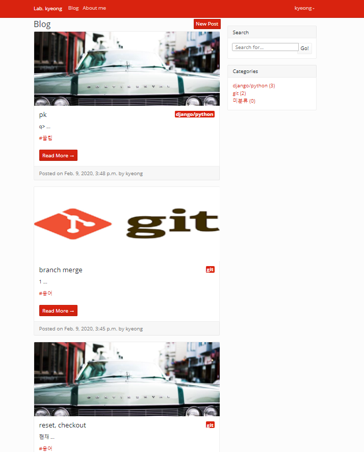

# # My blog Project
블로그 기본 기능 구현에 집중하여 진행한 프로젝트.


## # My Blog



## # 주요기능

* 메인화면(upSide)
  - 메인화면, 마이페이지(About me), 로그인, 회원가입으로 향할 수 있는 메뉴들이 있습니다.

* 메인화면(leftSide)
  - 로그인한 사용자에 한해 새 포스트를 작성할 수 있는 페이지로 향할 수 있습니다.
  - 포스트의 내용(제목,내용,작성일)을 미리보기로 보여줍니다.
  - 포스트에 업로드한 사진이 보여지며, 없을 경우 랜덤한 사진이 보여집니다.
  - 포스트의 카테고리를 보여줍니다.
  - 포스트의 상세페이지로 향할 수 있습니다.
  - 태그 별로 포스트가 모여있는 페이지로 향할 수 있습니다.
  - 태그는 관리자가 임의로 추가할 수 있습니다.

* 메인화면(rightSide)
  - 검색기능을 통해 제목이나 내용에 검색결과가 포함된 포스트들이 모여있는 페이지로 향할 수 있습니다.
  - 카테고리별로 상품이 모여있는 페이지로 향할 수 있습니다.
  - 카테고리는 관리자가 임의로 추가할 수 있습니다.

  ```
        //상품 카테고리 별로 페이지에 카테고리에 해당하는 상품을 보여주도록 함.
        class PostListByCategory(ListView):
            def get_queryset(self):
                slug = self.kwargs['slug']

                if slug=='_none':
                    category = None
                else:
                    category = Category.objects.get(slug=slug)

                return Post.objects.filter(category=category)
            def get_context_data(self, **kwargs):

                context = super(type(self), self).get_context_data(**kwargs)
                context['category_list'] = Category.objects.all()
                context['posts_without_category'] = Post.objects.filter(category=None).count()
                slug = self.kwargs['slug']
                if slug == '_none':
                    context['category'] = '미분류'
                else:
                    category = Category.objects.get(slug=slug)
                    context['category'] = category

                return context

  ```


* 로그인과 회원가입
  - 로그인과 회원가입은 django-allauth를 사용하였습니다.

* About me
  - 블로그 소유자의 프로필을 볼 수 있습니다.

* Blog
  - 메인페이지를 보여줍니다.

* POST PAGE
  - 전체 포스트를 최신 작성 순으로 상단에 5개까지 나열해줍니다.
  - 카테고리/태그/검색결과 내에서 포스트를 최신 작성 순으로 상단에 5개까지 나열해줍니다.

* PRODUCT DETAIL
  - 포스트의 제목과 작성자 및 작성일자와 작성한 내용 전부가 보여집니다.
  - 업로드 한 포스트의 사진이 보여집니다.
  - 포스트의 카테고리가 보여집니다
  - 로그인 한 사용자에 한해 포스트를 수정할 수 있습니다
  - 로그인 한 사용자에 한해 포스트를 삭제할 수 있습니다
  - 로그인 한 사용자에 한해 댓글을 달 수 있습니다.


    ```
        //로그인 한 사용자에 한해 댓글을 달 수 있게 함.
        def new_comment(request, pk):
            post = Post.objects.get(pk=pk)

            if request.method == 'POST':
                comment_form = CommentForm(request.POST)
                if comment_form.is_valid():
                    comment = comment_form.save(commit=False)
                    comment.post = post
                    comment.author = request.user
                    comment.save()
                    return redirect(comment.get_absolute_url())

            else:
                return redirect('/blog/')

  ```
* Comment
  - 작성자에 한해 댓글 수정과 삭제가 가능합니다.
  - 작성자 별로 각기 다른 아바타를 보여줍니다.

